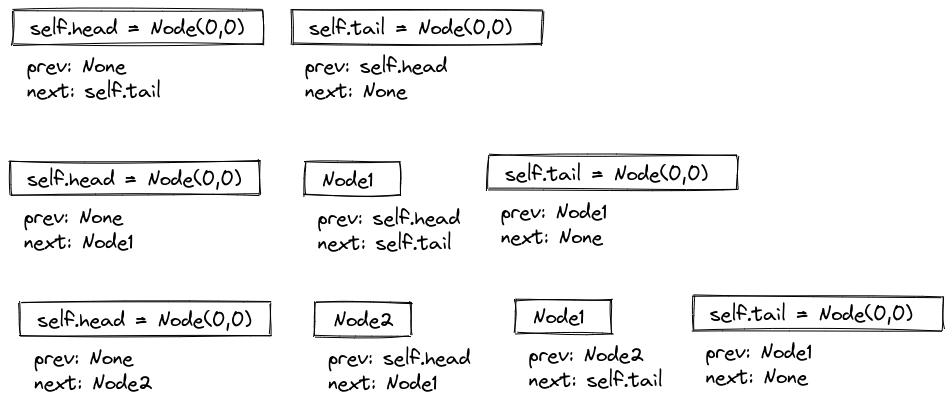

# LRU-cache



Класс должен содержать следующие методы

```python
class LRUCache:
    def __init__(self, capacity: int=10) -> None:
        pass

    def get(self, key: str) -> str:
        pass

    def set(self, key: str, value: str) -> None:
        pass

    def rem(self, key: str) -> None:
        pass
```

Проверяться работоспособность должна так:

```python
from cache import LRUCache

cache = LRUCache(100)
cache.set('Jesse', 'Pinkman')
cache.set('Walter', 'White')
cache.set('Jesse', 'James')
cache.get('Jesse') # вернёт 'James'
cache.rem('Walter')
cache.get('Walter') # вернёт ''
```

###### Ссылки

[Caching in Python Using the LRU Cache Strategy (RealPython)](https://realpython.com/lru-cache-python/)

[Design a data structure for LRU Cache (GfG)](https://www.geeksforgeeks.org/design-a-data-structure-for-lru-cache)

[Implementing LRU Cache Decorator in Python (GfG)](https://www.geeksforgeeks.org/implementing-lru-cache-decorator-in-python/)

[LRU Cache in Python using OrderedDict (GfG)](https://www.geeksforgeeks.org/lru-cache-in-python-using-ordereddict/)
